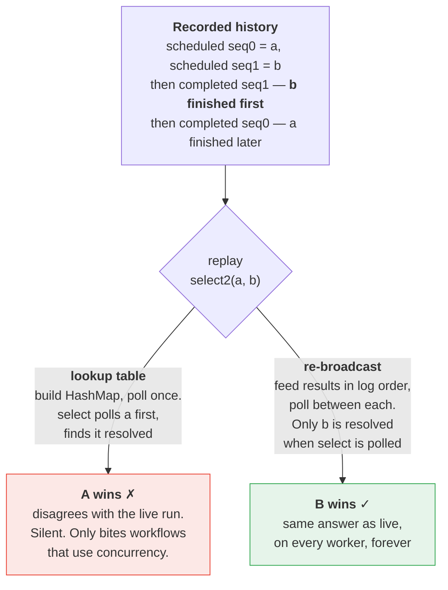

# Design notes

Three things, in order: where the design comes from, how the code implements it,
and what it is still missing compared with a real SDK runtime.

---

## Part 1 — Deriving durable execution from first principles

This is the derivation Temporal's design follows. (Paraphrased from how Maxim
Fateev frames it publicly, not quoted.)

### Step 0. The problem

> Write a program that runs for months, survives process death at any
> instruction, and does not require me to hand-roll a state machine and persist
> its state by hand.

The status quo is: define a state enum, write it to a database after every step,
handle every partial-failure window between "did the thing" and "saved that I
did the thing", and turn every code change into a schema migration.

### Step 1. A program's state is already fully described

The state of a running program is its **call stack + locals + program counter**.
Nothing else. If we could snapshot and restore that, we would be finished, and
the programmer would write ordinary code.

### Step 2. But you cannot persist a continuation

- The stack layout is tied to one binary; a deploy invalidates every snapshot.
- Not portable across languages.
- Reachable state is unbounded: sockets, file handles, thread state.
- Serialising arbitrary closures is impractical.

Rejected.

### Step 3. The inversion

> Do not persist the state. Persist the **inputs**.

If the program is deterministic, `state = f(inputs)`. So we never have to store
the state — we can always **recompute** it by re-running the program.

This is the whole idea. Everything below is a consequence.

Corollary, and it is the one to internalise: **the event log is the source of
truth; the running workflow object is a cache.** A cache you are allowed to drop
at any moment, for any reason, with no coordination.

### Step 4. What are "the inputs"?

Everything that crossed the boundary from outside the program:

- the initial arguments, and
- the result of every external interaction — API calls, timers, signals, the
  clock, randomness.

Finite and enumerable — **if** every external interaction is forced through one
narrow API. Which gives us the next two steps.

### Step 5. Therefore: commands

Workflow code must not perform I/O. It can only emit *requests* that something
else fulfils: `ScheduleActivity`, `StartTimer`. → [`src/command.rs`](src/command.rs)

And a result must be **durably recorded before the program is allowed to observe
it** — otherwise the recomputation would be missing an input. → append-only
history, [`src/history.rs`](src/history.rs)

This is why the Command/Event split is a type-level distinction and not
bookkeeping: a Command is a cheap intent re-derived on every replay, an Event is
a fact written once.

### Step 6. Therefore: determinism

Recomputation only works if the program is a function. So the workflow may not
read a wall clock, generate randomness, iterate a hash map, or use a scheduler
with a non-deterministic ready queue.

Each of those needs a history-backed replacement, or the guarantee is void:
`ctx.now_ms()`, `ctx.random_u64()`, and the general escape hatch
`ctx.side_effect()`. → [`src/workflow.rs`](src/workflow.rs)

### Step 7. Therefore: ordinal identity

On replay we reach an await point and must decide which recorded result belongs
to it. The program has no identifier to offer us. But it is deterministic — so
**position works**: the Nth external request is always the same Nth request.

Hence sequence numbers, and hence the requirement that the ordinal be assigned
in an order the *language* guarantees. See **Guarantee A** below.

### Step 8. Therefore: replay is a re-broadcast, not a lookup

The world does not fulfil requests in the order they were made. The log records
completions in whatever order they arrived. If replay simply asks "is this
resolved?", a workflow that raced two requests can observe a different winner
than it did live.

So replay must re-deliver recorded results **in log order**, running the
workflow to quiescence between each. See **Guarantee B** below.

### Step 9. Therefore: at-least-once, as a theorem

"Perform the side effect" and "record that it happened" are in different failure
domains — the external world and our log. No protocol makes them atomic. A
crash in between is always possible.

Therefore activities are at-least-once and must be idempotent. This is not a
limitation of Temporal's implementation; it is a property of the problem.
Demonstrated by `cargo run --example order_saga -- crash-before-record 2`.

### Step 10. Therefore: history size is a first-class cost

Replay is O(history), and it happens on every cache miss, so a workflow's total
replay cost is O(n²) in its own length. Hence hard history limits and
`continue_as_new`; hence the sticky cache that makes the common case O(1).

### Step 11. Therefore: code is part of the input

Changing the workflow function changes `f`, so it changes the recomputation of
every in-flight execution. Either never change it, or make the change itself a
**recorded fact** — which is exactly what `patched()` / `GetVersion` does, using
the same marker mechanism as `side_effect`.

---

## Part 2 — The two guarantees, and where they live

### A. Identity is anchored to an order the *language* guarantees

`Seq` is handed out in `WfContext::issue` at the moment `ctx.activity(..)` is
**called** — so it follows Rust's specified expression evaluation order.

The tempting alternative is to assign on first `poll`. That anchors identity to
whichever order a combinator polls its branches in, which is a library detail:
`tokio::select!` **randomises** branch order by default. Anchoring there would
silently renumber every await point.

The price: these futures are not lazy. Creating one issues the command even if
you drop it unawaited. Temporal's real Rust SDK has the same property, for the
same reason.

Proven by `seq_follows_creation_order_not_poll_order`.

**Where A stops.** The language guarantees *evaluation order*, not *what you
evaluate*. A workflow that reads a real clock and still emits the same command
shape passes every check we have and computes a different answer. Proven — as a
known gap — by `impure_code_with_stable_command_shape_is_not_caught`.

### B. The runtime order is NOT reproducible — and must not need to be

The engine does not make the world orderly. It **records** whatever interleaving
happened and replays *that*.

The first version of this repo got it wrong in the standard way: build
`HashMap<Seq, Outcome>` from history, poll once, let every resolved await
return. That discards the one piece of information that makes replay faithful —
the order the log was written in.

Concretely, `select2(a, b)` where `b` finished first: live, the workflow saw only
`b` resolved and took `b`'s branch. Later `a` finished too. A lookup-table replay
polls `a` first, finds it resolved, and takes `a`'s branch. Same code, same
history, different answer — and invisible until a workflow uses concurrency.



Fixed in `replay_once`: results are re-broadcast one at a time, in log order,
with `run_until_all_blocked` between each.

Proven by `the_recorded_interleaving_decides_the_winner` and
`replay_reproduces_the_recorded_race_not_the_poll_order`.

---

## Part 3 — Walkthrough of one workflow task

Take the saga after `charge_card` has completed and `reserve_inventory` is
outstanding. History:

```
1  WorkflowExecutionStarted   input=order-42, seed=..
2  WorkflowTaskStarted        attempt=1
3  ActivityTaskScheduled [0]  charge_card(order-42)
4  ActivityTaskCompleted [0]  -> pay-75844
5  WorkflowTaskStarted        attempt=2
6  ActivityTaskScheduled [1]  reserve_inventory(order-42)
```

**1. `Worker::run` seeds the clock and opens a task.**
`clock_ms = max(clock_ms, history.last_time_ms())` so time never goes backwards
across a restart, then appends `WorkflowTaskStarted`.

**2. `replay_once` builds a brand-new workflow future.**
`WfState` starts with `resolved` **empty**, `markers` from history, `rng` from
`WorkflowExecutionStarted.randomness_seed`, `recorded_command_count = 2`.

**3. First `run_until_all_blocked` — before any result is visible.**
The workflow runs from line 1, calls `ctx.activity("charge_card", ..)` → `Seq 0`,
pushes the command, awaits. `ActivityFuture::poll` finds nothing in `resolved` →
`Pending`. The root future parks. `commands = [0]`.

**4. Re-broadcast, one result at a time, in log order.**
`history.results_in_order()` yields `[{seq: 0, Completed("pay-75844"), t=11}]`.
Insert it into `resolved`, poll again. Now the parked await returns `Ok`, and as
a side effect `observe()` advances `now_ms` to 11 — that is where `ctx.now_ms()`
gets its value. Execution continues to `ctx.activity("reserve_inventory", ..)` →
`Seq 1`, `Pending` again. `commands = [0, 1]`.

**5. Results exhausted. The pass ends; the future is dropped.**
Every local, the parked stack frame, the spawned tasks — gone. `Pass { poll:
Pending, commands: [0, 1], logs, deadlocked: false }`.

**6. Verify.** `recorded = [ScheduleActivity 0 charge_card, ScheduleActivity 1
reserve_inventory]`. Command 0 matches, command 1 matches. Nothing new to
persist. (Had the code changed, this is where it fails, naming the index.)

**7. Advance.** `resolved_seqs = {0}`, so the outstanding command is `Seq 1`. The
driver invokes the real activity — *the only line in the system that touches the
world* — then appends `ActivityTaskCompleted[1]` at `t = clock + 10`.

**8. Loop.** Next task replays from scratch with three results to re-broadcast.

Note what step 3–4 buy that a single poll would not: the workflow observed
result 0 *before* result 1 existed, exactly as it did live. With `select2`, that
is the difference between correct and silently wrong.

### Where the pieces are

| Step | Code |
| --- | --- |
| the loop | `Worker::run`, [`src/driver.rs`](src/driver.rs) |
| suspension with no waker | `ActivityFuture::poll`, [`src/workflow.rs`](src/workflow.rs) |
| ordinal identity | `WfContext::issue` |
| order-faithful re-broadcast | `replay_once` + `History::results_in_order` |
| run until all blocked | `run_until_all_blocked` |
| non-determinism check | `Command::matches` + the verify loop |
| the only real I/O | `Worker::advance` → `ActivityRegistry::invoke` |

---

## Part 4 — What a real SDK runtime does that we do not

Ranked by how much they would change **this** codebase. For the full inventory
with real API names, see
[README: What is missing compared to real Temporal](README.md#what-is-missing-compared-to-real-temporal).

| # | Technique | Real SDKs | Here |
| --- | --- | --- | --- |
| 1 | **Sticky execution + LRU workflow cache** | Worker keeps the live coroutine keyed by run id; the server routes follow-up tasks to that worker via a sticky task queue. Cache miss → full replay. | Always full replay. Correct, but O(history) per task. |
| 2 | **`WorkflowActivation` / job protocol** | sdk-core sends the language side a *batch of jobs* (`FireTimer`, `ResolveActivity`, `SignalWorkflow`, `QueryWorkflow`, `RemoveFromCache`) and gets commands back. History never crosses the boundary. | We hand the whole history to `replay_once`. This is the abstraction that makes both the cache and multi-language support possible. |
| 3 | **Per-command state machines** | Explicit FSMs: `Created → CommandIssued → Scheduled → Started → Completed / Failed / Cancelled`, driven by `apply_next_event`. | Flat `Vec<Command>` position matching. Cannot express cancellation or activity retry lifecycle. **This is Phase 3.** |
| 4 | **Determinism sandbox** | TypeScript runs workflows in an isolated VM with `Date`, `Math.random`, `setTimeout` and all I/O replaced. Python re-imports modules and blocks known non-deterministic ones. Go and Java rely on convention plus detection. | Nothing. `impure_code_with_stable_command_shape_is_not_caught` is the demonstration of the hole. |
| 5 | **Deadlock detection** | A watchdog fails the workflow task if it does not yield within N seconds (Go: 1s default). | An infinite loop inside one `poll` hangs us forever. `MAX_ROUNDS` only catches spawn storms. |
| 6 | **Versioning** — `patched()` / `GetVersion`, worker build IDs | Records a marker so in-flight executions keep the old branch and new ones take the new one. | Nothing. Our nondeterminism demo shows the problem this exists to solve. Cheap to add: `side_effect` is already the mechanism. |
| 7 | **`continue_as_new` + history limits** | Hard caps (~50k events / ~50MB) with earlier warnings; `continue_as_new` closes the history and opens a fresh one carrying forward state. | Unbounded history, unbounded replay cost. |
| 8 | **Signals, queries, updates** | External input into a running execution. Queries are read-only replays that must emit **zero** commands — the SDK enforces it. Updates are validated and durable. | None. Signals are the natural Phase 4 start: a `WorkflowExecutionSignaled` event delivered at exactly its recorded position. |
| 9 | **Retries and the four timeouts** | schedule-to-start, start-to-close, schedule-to-close, heartbeat — each meaning something different — plus retry policy with backoff coefficient and non-retryable error types. | One attempt; whatever happens is recorded. |
| 10 | **Activity heartbeating** | Long activities report progress with a details payload; enables timeout detection and resumption mid-activity. | None. |
| 11 | **Local activities** | Executed in the worker process, recorded via markers, no server round trip. Large latency win, subtle semantics. | `side_effect` is the degenerate case of this. |
| 12 | **Cancellation and scopes** | Cancelling propagates to in-flight activities, timers and child workflows; needs #3 to express. | None. |
| 13 | **Child workflows / Nexus** | Composition, including across namespaces. | None. |
| 14 | **Server-side sharding** | History sharded by workflow id; per-shard transfer / timer / visibility queues; single-writer shard ownership. | One process. **Phase 2.** |
| 15 | **Conditional history append** | Append is conditional on `next_event_id` and the shard range id, so two workers cannot fork a history. This is the actual durability primitive. | `Vec::push`. **Phase 1.** |
| 16 | **Data converter / payload codec** | Pluggable serialisation, encryption, compression; activity inputs must serialise deterministically. | `String`. |
| 17 | **Replay testing** | `WorkflowReplayer` runs archived histories against new code in CI, catching non-determinism before deploy. | Not built, but we are ~20 lines away: `replay_once` against a stored `History` already is this. |

### What we do have that is real

Event sourcing and replay; the command/event split; ordinal identity anchored to
a language guarantee; **order-faithful re-broadcast** (the thing most toy
implementations get wrong); non-determinism detection; marker-recorded side
effects; a deterministic clock and PRNG; a run-until-all-blocked scheduler with
detached tasks; and an executable demonstration that activities are
at-least-once.

### One thing Rust gives us for free

Go ships a coroutine dispatcher, Java ships `DeterministicRunner`, Python ships a
custom `asyncio` event loop — all so that "run every coroutine until they are all
blocked" is deterministic. Their concurrency primitives are *detached*, so the
SDK must own the scheduler.

A composed Rust future is a tree, and one `poll` of the root drives the whole
tree in a single deterministic pass. For structured concurrency, `join2` and
`select2` need no scheduler at all. Only `ctx.spawn` — genuinely detached work —
needs the fixpoint loop in `run_until_all_blocked`.
