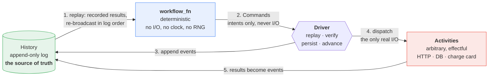
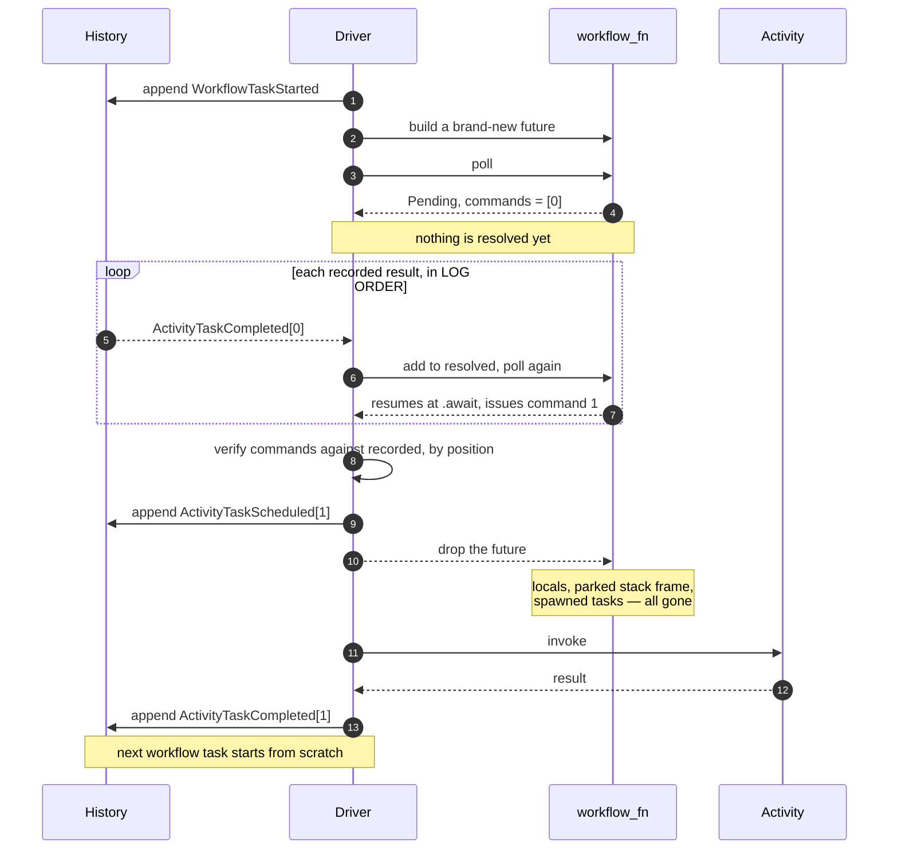
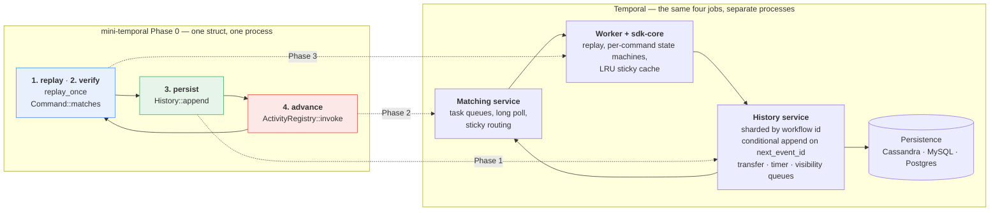

# mini-temporal

A durable execution engine written from scratch, to understand how
[temporal](https://github.com/temporalio/temporal),
[cadence](https://github.com/uber/cadence),
[Azure/durabletask](https://github.com/Azure/durabletask) and
[sdk-core](https://github.com/temporalio/sdk-core) actually work.

```
cargo run --example order_saga        # four demos
cargo test                            # 15 properties Phase 0 must have
```

**[DESIGN.md](DESIGN.md)** has the first-principles derivation, a line-by-line
walkthrough of one workflow task, and a ranked list of what a real SDK runtime
does that this does not.

---

## The one idea

> **A workflow is a pure function of its event history.**
>
> ```
> commands = replay(workflow_fn, history)
> ```

Recovery is not a feature bolted onto execution. Recovery **is** the execution
model. To resume a workflow you re-run its function from the very first line and
feed it the recorded history; every step that already has a result returns that
result instead of doing the work again. When replay catches up with the end of
the history, execution goes live and new commands come out.



Everything on the blue side is a pure function of the green log. Everything that
can fail unpredictably is on the red side, and its every outcome is frozen into
the log before the workflow is allowed to see it.

Consequences follow, and Phase 0 demonstrates each:

| Claim | See |
| --- | --- |
| Recorded work is never re-executed | `cargo run --example order_saga -- crash-after 2` |
| Activities are at-least-once, never exactly-once | `-- crash-before-record 2` |
| Editing live workflow code is caught, not silently wrong | `-- nondeterminism` |
| Timers are durable events, not sleeping threads | `timers_are_events` |
| Identity follows creation order, not poll order | `seq_follows_creation_order_not_poll_order` |
| Replay reproduces the *recorded* race, not the poll order | `replay_reproduces_the_recorded_race_not_the_poll_order` |
| Clock, randomness and `side_effect` all come from history | `workflow_time_is_replay_stable`, ... |
| ...and shape checking still cannot catch impure code | `impure_code_with_stable_command_shape_is_not_caught` |

---

## Are Temporal / Cadence / DurableTask / sdk-rust the same thing?

At the core, yes. All of them are event-sourced deterministic replay.

```
AWS SWF (2012)  --  decider + activity worker, "decision task"
      |
      v
Cadence (Uber, 2016)  --fork-->  Temporal (2019)

Azure DurableTask Framework (~2014)   -- independently converged on the same design
      |-- Azure Durable Functions
      `-- durabletask-go  -->  Dapr Workflow
```

Everything they do differently sits *outside* the core:

| | Temporal / Cadence | Azure DurableTask | sdk-core / sdk-rust |
| --- | --- | --- | --- |
| Role | server | server + SDK | **client side only** |
| Decomposition | frontend / history / matching / worker; history sharded by workflow id | single service, pluggable backend (Azure Storage, MSSQL, Netherite, DTS) | n/a |
| Internal scheduling | transfer / timer / visibility task queues per shard | queues | n/a |
| Naming | Cadence: `domain`, `decision task`<br>Temporal: `namespace`, `workflow task` (pure rename) | `orchestration`, `task hub` | `activation`, `command` |
| Suspending user code | Go SDK: custom goroutine dispatcher. Java: threads | .NET: custom `TaskScheduler` + `await`. JS: generator `yield` | Rust `Future`, polled by hand |

`sdk-core` is the one worth reading closely: it is the shared Rust engine behind
the TypeScript, Python, .NET, Ruby and Rust SDKs (Go and Java SDKs are native and
do not use it), and it makes the replay machinery **explicit** — one state
machine per command type — where other SDKs leave it implicit.

---

## The loop

One iteration = one *workflow task*. This is [`src/driver.rs`](src/driver.rs):

```
1. replay    workflow_fn(history)  ->  Poll + Vec<Command>
2. verify    new commands == recorded commands, position by position
3. persist   append events for commands history has never seen
4. advance   run the pending activities / fire the earliest timer,
             append their results
5. discard   throw the entire future away, go to 1
```



Step 5 is not a shortcut. A Temporal worker with a cold cache does exactly this,
and it is the case that has to be correct — it happens on every deploy, every
cache eviction, and every crash. Keeping the coroutine alive between tasks (the
"sticky" cache) is an optimisation, and it is Phase 4.

The trick that makes step 2 possible is in [`src/workflow.rs`](src/workflow.rs):
each `ctx.activity(...)` takes the next **sequence number**. Because the workflow
is deterministic, the Nth thing it schedules is always the same Nth thing, so a
recorded result can be matched back to the await point waiting for it — without
the workflow persisting any state of its own.

Note what is missing from `ActivityFuture::poll`: there is no waker, and nothing
ever completes it. It returns `Pending` forever. The workflow's state *is* the
suspended stack frame, and the driver discards it and rebuilds it by replaying.

---

## Files

| File | What it is |
| --- | --- |
| [`src/workflow.rs`](src/workflow.rs) | `WfContext`. How `.await` suspends without ever being woken. **Read first.** |
| [`src/driver.rs`](src/driver.rs) | The replay / verify / persist / advance loop. This is the engine. |
| [`src/history.rs`](src/history.rs) | The only durable state in the system. |
| [`src/command.rs`](src/command.rs) | Why intents and facts are different types. |
| [`src/activity.rs`](src/activity.rs) | The only place real work happens. |
| [`src/combinators.rs`](src/combinators.rs) | `join2` / `select2`, and why Rust needs so much less scheduler than Go or Python. |

## What `Worker` is standing in for

One struct plays three roles that Temporal splits across a cluster. Phase 1 and
Phase 2 are exactly the work of pulling them apart along these lines.



## What is missing compared to real Temporal

Specific, with the real API names, so you can go look each one up. Grouped by
what it would take to add. API names are from memory — worth checking against
the current HEAD of each repo.

[DESIGN.md](DESIGN.md) Part 4 ranks these by how much they would change *this*
codebase; the list here is the inventory.

### 1. Engine and runtime — these change replay itself

| Real Temporal | What it does | Here |
| --- | --- | --- |
| **Sticky execution + workflow cache** — sticky task queue, `worker.SetStickyWorkflowCacheSize` (Go) / `maxCachedWorkflows` (TS), `StickyScheduleToStartTimeout` | Worker keeps the live coroutine keyed by run id; the server routes follow-up workflow tasks back to that worker. Cache miss → full replay. | Always full replay. Correct, but O(history) per task, so O(n²) over a workflow's life. |
| **`WorkflowActivation` job protocol** — jobs like `StartWorkflow`, `FireTimer`, `ResolveActivity`, `SignalWorkflow`, `QueryWorkflow`, `NotifyHasPatch`, `DoUpdate`, `UpdateRandomSeed`, `RemoveFromCache` | sdk-core hands the language side one *batch of jobs* and gets commands back. Raw history never crosses the boundary. | `replay_once` is handed the whole `History`. This abstraction is what makes both the cache and multi-language SDKs possible. |
| **One state machine per command** — `sdk-core/core/src/worker/workflow/machines/`: `activity_state_machine.rs`, `timer_state_machine.rs`, `child_workflow_state_machine.rs`, `local_activity_state_machine.rs`, `patch_state_machine.rs`, `signal_external_state_machine.rs`, `cancel_external_state_machine.rs`, `continue_as_new_workflow_state_machine.rs`, `upsert_search_attributes_state_machine.rs`, `workflow_task_state_machine.rs`, driven by `WorkflowMachines::apply_next_event` | Explicit lifecycle: `Created → CommandIssued → Scheduled → Started → Completed / Failed / Cancelled`. | Flat `Vec<Command>` position matching in `Worker::run`. Cannot express cancellation or the activity retry lifecycle at all. **Phase 3.** |
| **Determinism sandbox** | TS runs workflow code in a V8 isolate with `Date`, `Math.random`, `setTimeout`, `process`, and all I/O replaced. Python ships `SandboxedWorkflowRunner` with import restrictions and `workflow.unsafe.imports_passed_through()`. Go and Java rely on convention plus detection. | Nothing. `impure_code_with_stable_command_shape_is_not_caught` is a test that *documents the hole*: shape checking passes, the answer is wrong. |
| **Deadlock detector** — `WorkerOptions.DeadlockDetectionTimeout` (Go, default 1s) | Watchdog fails the workflow task if it does not yield in time. | An infinite loop inside one `poll` hangs the process. `MAX_ROUNDS` only catches spawn storms. |
| **Condition variables** — `workflow.Await(ctx, cond)`, `workflow.AwaitWithTimeout` | Block until a predicate over workflow state becomes true; re-evaluated on every activation. | None. Everything must be expressed as awaiting a specific command. |
| **Queries** — `workflow.SetQueryHandler`, `QueryRejectCondition` | A read-only replay that must emit **zero** commands; the SDK enforces it. | None. |
| **Own coroutine scheduler** — Go's dispatcher in `internal/internal_workflow.go` (`ExecuteUntilAllBlocked`, `coroutineState`), Java's `DeterministicRunner` / `WorkflowThread`, Python's custom `asyncio` event loop | Deterministic "run every coroutine until all are blocked". | We have this, but cheaply: `run_until_all_blocked` is a fixpoint loop, and for structured concurrency Rust gives it for free — see [`src/combinators.rs`](src/combinators.rs). |

### 2. Durability and change management

| Real Temporal | What it does | Here |
| --- | --- | --- |
| **Conditional history append** | Append is a conditional write guarded by `next_event_id` *and* the owning shard's `RangeID` fencing token, so two workers can never fork a history. **This is the actual durability primitive.** | `Vec::push`. **Phase 1.** |
| **History limits + `continue_as_new`** — `workflow.NewContinueAsNewError`; server dynamic config for history count/size warn and error thresholds | Bounds replay cost and mutable-state size; `continue_as_new` closes one history and opens a fresh one carrying state forward. | Unbounded history, unbounded replay cost. |
| **Versioning** — `workflow.GetVersion` (Go), `patched()` / `deprecatePatch()` (core/TS), Worker Versioning with Build IDs and Worker Deployment Versioning | Records the branch choice as a fact, so in-flight executions keep the old path and new ones take the new one. | Nothing. Our `nondeterminism` demo is precisely the problem this solves — and `ctx.side_effect` is already the mechanism it is built on. |
| **Replay testing** — `worker.WorkflowReplayer` (Go), `Replayer` (TS/Python) | Runs archived histories against new code in CI, catching non-determinism *before* deploy. | Not built, but ~20 lines away: `replay_once` against a stored `History` already is this. |
| **Reset / terminate / cancel** — `ResetWorkflowExecution` to a chosen event id | Rewinds an execution to a point in its own history and re-runs forward. | None. |

### 3. Activity semantics

| Real Temporal | What it does | Here |
| --- | --- | --- |
| **Four timeouts** — `ScheduleToStartTimeout`, `StartToCloseTimeout`, `ScheduleToCloseTimeout`, `HeartbeatTimeout` | Each covers a different failure: queue backlog, a stuck attempt, the whole operation, a silent worker. | None. |
| **Retry policy** — `InitialInterval`, `BackoffCoefficient`, `MaximumInterval`, `MaximumAttempts`, `NonRetryableErrorTypes` | Server-driven retries recorded as attempts on the activity. | One attempt; whatever happens is recorded. |
| **Heartbeating** — `activity.RecordHeartbeat`, `activity.GetHeartbeatDetails` | Long activities report progress and can resume mid-work after a retry. | None. |
| **Async completion** — return `activity.ErrResultPending`, finish later via `client.CompleteActivity` | Hand the activity off to a human or an external system. | None. |
| **Local activities** — `workflow.ExecuteLocalActivity` | Runs in the worker process, recorded as a `MarkerRecorded` event, no server round trip. | `ctx.side_effect` is the degenerate case of this. |
| **Cancellation and scopes** — `workflow.WithCancel`, `CancellationScope` (Java/TS) | Cancelling propagates to in-flight activities, timers and children. Needs the state machines above. | None. |

### 4. Composition and external input

| Real Temporal | Here |
| --- | --- |
| **Signals** — `workflow.GetSignalChannel`, `SignalWithStartWorkflow` | None. A `WorkflowExecutionSignaled` event delivered at exactly its recorded position is the natural Phase 4 start. |
| **Updates** — `workflow.SetUpdateHandler` with a validator; durable, returns a result | None. |
| **Child workflows** — `workflow.ExecuteChildWorkflow`, parent-close policies | None. |
| **Nexus** — calls across namespaces and services | None. |
| **Schedules / cron** — `ScheduleClient`, `CronSchedule` | None. |
| **`MutableSideEffect`** (Go) | Records a marker only when the value changes. |
| **Sessions** (Go) | Pins a series of activities to one worker host. |

### 5. Data and observability

| Real Temporal | Here |
| --- | --- |
| **Data converter** — `PayloadConverter`, `PayloadCodec`, codec server for encryption/compression | `String`. Activity inputs must also serialise *deterministically*, which a naive map-based JSON encoder does not. |
| **Search attributes and visibility** — `UpsertSearchAttributes`, Elasticsearch or SQL visibility store | None. `pretty()` is our entire UI. |
| **Interceptors** — `WorkflowInboundInterceptor`, `WorkflowOutboundInterceptor`, `ActivityInboundInterceptor`, client interceptors | None. |
| **Metrics and tracing** — `workflow.GetMetricsHandler`, OpenTelemetry interceptors | None. |

### 6. Server-side operations

All of this is a single `Worker` struct here. **Phase 2** is pulling the first
two out; the rest is deliberately out of scope for a learning project.

Sharding of history by workflow id with `RangeID` ownership · per-shard transfer,
timer and visibility task queues · task queue partitioning and forwarding ·
long-poll matching with sticky routing · frontend rate limiting and API
versioning · namespaces, mTLS, claim mapper and authorizer · archival ·
multi-cluster replication (xdc) · eager workflow start and eager activity
dispatch.

---

## Phase plan

| Phase | Deliverable | Question it answers |
| --- | --- | --- |
| **0** ✅ | single process, in-memory, crash + replay + non-determinism demos | what is replay, really |
| **1** | `HistoryStore` trait + SQLite; append becomes a conditional write on `next_event_id` | how does history stay exactly-once under concurrent workers |
| **2** | split server / worker processes, long-polled task queues, workflow-task timeout, activity retry policies | where do distributed semantics come from |
| **3** | replace the flat `Vec<Command>` comparison with one state machine per command type, as sdk-core does | what is sdk-core actually doing |
| **4** | persisted timer queue, signals, queries, `continue_as_new`, child workflows, cancellation, sticky cache + eviction, `patched()` versioning | where does the production complexity come from |

Phase 0 is ~1000 lines and contains all of the magic. Every later phase is
engineering on top of the same loop, and comes straight out of the inventory
above.

## Reading the real thing

Approximate entry points — worth verifying against the current HEAD of each repo,
since layouts move:

| Concept here | Real code |
| --- | --- |
| `Event` | `temporalio/api`: `temporal/api/history/v1/message.proto` |
| `Command` | `temporalio/api`: `temporal/api/command/v1/message.proto` |
| `driver.rs` step 2 | `temporalio/sdk-core`: `core/src/worker/workflow/machines/workflow_machines.rs` |
| per-command state machines | `sdk-core`: `machines/activity_state_machine.rs`, `machines/timer_state_machine.rs` |
| `WfContext` | `sdk-core`: `sdk/src/workflow_context.rs` |
| suspending user code, other style | `temporalio/sdk-go`: `internal/internal_workflow.go` (coroutine dispatcher) |
| history append, sharding, task queues | `temporalio/temporal`: `service/history/`, `service/matching/` |
| the same idea in .NET | `Azure/durabletask`: `src/DurableTask.Core/TaskOrchestrationExecutor.cs`, `OrchestrationRuntimeState.cs` |
